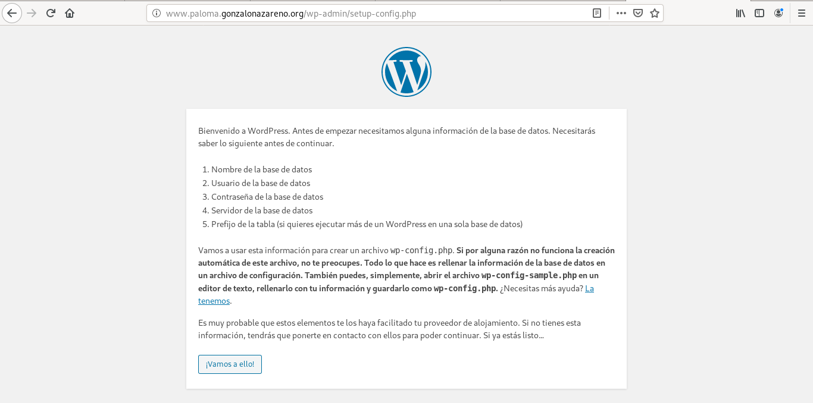
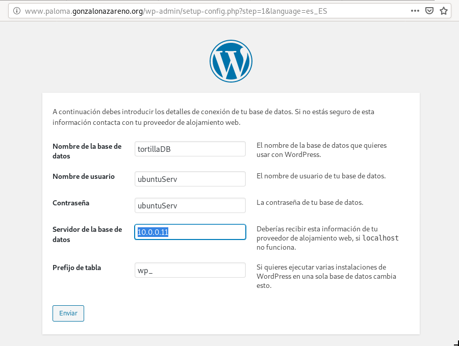
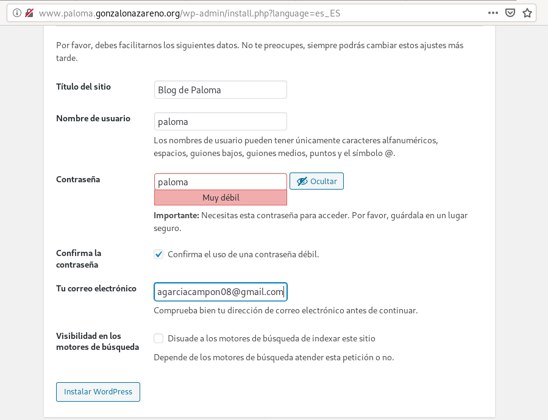

# Tarea 3) Instalación aplicaciones web

Vamos a instalar dos aplicaciones web php en nuestros servidores:
- En www.tunombre.gonzalonazareno.org vamos a instalar WordPress. En WordPress debemos configurar de forma correcta las URL limpias.
- En cloud.tunombre.gonzalonazareno.org vamos a instalar NextCloud.

Modifica las aplicaciones web y personalizalas para que se demuestre que son tus aplicaciones. Entrega una breve descripción de los pasos dados para conseguir la instalación de las aplicaciones web. Usando resolución estática entrega algunas capturas donde se demuestre que las aplicaciones están funcionando.

## Actualización de php
En ejercicios anteriores se ha descargado php y sus extensiones en la versión 5.4. Hay que actualizarlo todo a la versión 7.2 de la siguiente manera.

Se borran las versiones anteriores, agregan los repositorios necesarios y se instalan.

## Configuración de selinux para WordPress
Selinux no permite el acceso al instalador de wordpress desde un navegador, por lo tanto hay que introducir los siguientes comandos para permitir el acceso:
~~~
[centos@salmorejo ~]$ sudo chown nginx:nginx -R /usr/share/nginx/html/wordpress
[centos@salmorejo ~]$ sudo find /usr/share/nginx/html/wordpress -type f -exec chmod 0644 {} \;
[centos@salmorejo ~]$ sudo find /usr/share/nginx/html/wordpress -type d -exec chmod 0755 {} \;
[centos@salmorejo ~]$ sudo chcon -t httpd_sys_content_t /usr/share/nginx/html/wordpress -R
[centos@salmorejo ~]$ sudo chcon -t httpd_sys_rw_content_t /usr/share/nginx/html/wordpress/wp-config-sample.php 
[centos@salmorejo ~]$ sudo chcon -t httpd_sys_rw_content_t /usr/share/nginx/html/wordpress/wp-content -R
[centos@salmorejo ~]$ sudo systemctl restart nginx
~~~

## Configuración de la base de datos remota
Se ve como se encuentra la conectividad de la base de datos con el siquiente comando, buscando network_connect_db:
~~~
[centos@salmorejo ~]$ getsebool -a | grep httpd
~~~

En principio este es el resultado, pero hay que ponerlo en on:
~~~ 
httpd_can_network_connect_db --> off
~~~

Se levanta con el siguiente comando:
~~~
[centos@salmorejo ~]$ sudo setsebool -P httpd_can_network_connect_db 1
~~~

## Instalación de WordPress en Centos
Se descargan los paquetes que vamos a necesitar para la instalación de WordPress:
~~~
[centos@salmorejo ~]$ sudo yum install wget
[centos@salmorejo ~]$ sudo yum install unzip
~~~

Y se inicia la descarga de wordpress y se descomprime:
~~~
[centos@salmorejo ~]$ wget https://es.wordpress.org/latest-es_ES.zip
[centos@salmorejo ~]$ unzip latest-es_ES.zip 
~~~

Y se modifica el fichero de configuración de ngix /etc/ngix/conf.d/default.conf:
~~~
server {
    listen	 80;
    server_name  www.paloma.gonzalonazareno.org;

    # note that these lines are originally from the "location /" block
    root   /usr/share/nginx/html/wordpress;
    index index.php index.html index.htm;

    location / {
        try_files $uri $uri/ =404;
    }
    error_page 404 /404.html;
    error_page 500 502 503 504 /50x.html;
    location = /50x.html {
        root /usr/share/nginx/html/wordpress;
    }

    location ~ \.php$ {
        try_files $uri =404;
        fastcgi_pass unix:/var/run/php-fpm/php-fpm.sock;
        fastcgi_index index.php;
        fastcgi_param SCRIPT_FILENAME $document_root$fastcgi_script_name;
        include fastcgi_params;
    }
}
~~~

La siguiente pantalla indica que no ha encontrado el fichero wp-config.php:

Para ello, se crea el fichero y se introduce el código que sale por pantalla dentro del nuevo fichero:
~~~
[centos@salmorejo ~]$ sudo touch /usr/share/nginx/html/wordpress/wp-config.php
~~~

## Modificaciones Selinux para NextCloud

[centos@salmorejo html]$ sudo semanage fcontext -a -t httpd_sys_rw_content_t '/usr/share/nginx/html/nextcloud/data(/.*)?'
[centos@salmorejo html]$ sudo semanage fcontext -a -t httpd_sys_rw_content_t '/usr/share/nginx/html/nextcloud/config(/.*)?'
[centos@salmorejo html]$ sudo semanage fcontext -a -t httpd_sys_rw_content_t '/usr/share/nginx/html/nextcloud/apps(/.*)?
[centos@salmorejo html]$ sudo semanage fcontext -a -t httpd_sys_rw_content_t '/usr/share/nginx/html/nextcloud/.htaccess'
[centos@salmorejo html]$ sudo semanage fcontext -a -t httpd_sys_rw_content_t '/usr/share/nginx/html/nextcloud/.user.ini'
[centos@salmorejo html]$ sudo semanage fcontext -a -t httpd_sys_rw_content_t '/usr/share/nginx/html/nextcloud/3rdparty/aws/aws-sdk-php/src/data/logs(/.*)?'
[centos@salmorejo html]$ sudo restorecon -Rv '/usr/share/nginx/html/nextcloud/'

## Instalación de NextCloud

Descargar NextCloud:
~~~
[centos@salmorejo html]$ sudo wget https://download.nextcloud.com/server/releases/nextcloud-14.0.1.zip
~~~

Se descomprime:
~~~
[centos@salmorejo html]$ sudo inzip nextcloud-14.0.1.zip
~~~

Se cambian los permisos:
~~~
[centos@salmorejo html]$ sudo chown -Rf apache:apache nextcloud
~~~

Y se modifica el fichero de configuración nextcloud.conf:
~~~
server {
    listen	 80;
    server_name  cloud.paloma.gonzalonazareno.org;

    # note that these lines are originally from the "location /" block
    root   /usr/share/nginx/html/nextcloud;
    index index.php index.html index.htm;

    location / {
        try_files $uri $uri/ =404;
    }
    error_page 404 /404.html;
    error_page 500 502 503 504 /50x.html;
    location = /50x.html {
        root /usr/share/nginx/html/nextcloud;
    }

    location ~ \.php$ {
        try_files $uri =404;
        fastcgi_pass unix:/var/run/php-fpm/php-fpm.sock;
        fastcgi_index index.php;
        fastcgi_param SCRIPT_FILENAME $document_root$fastcgi_script_name;
        include fastcgi_params;
    }
}
~~~

Directorio para guardar los ficheros sincronizados:
~~~
[centos@salmorejo html]$ sudo mkdir -p /usr/share/nginx/html/nextcloud/data
[centos@salmorejo html]$ sudo chown -Rf nginx:nginx /usr/share/nginx/html/nextcloud/data/
~~~

