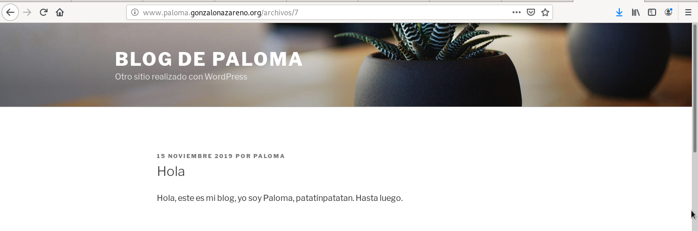

# Tarea 3) Instalación aplicaciones web

Vamos a instalar dos aplicaciones web php en nuestros servidores:
- En www.tunombre.gonzalonazareno.org vamos a instalar WordPress. En WordPress debemos configurar de forma correcta las URL limpias.
- En cloud.tunombre.gonzalonazareno.org vamos a instalar NextCloud.

Modifica las aplicaciones web y personalizalas para que se demuestre que son tus aplicaciones. Entrega una breve descripción de los pasos dados para conseguir la instalación de las aplicaciones web. Usando resolución estática entrega algunas capturas donde se demuestre que las aplicaciones están funcionando.

## Creación de sitio Wordpress
### Actualización de php
En ejercicios anteriores se ha descargado php y sus extensiones en la versión 5.4. Hay que actualizarlo todo a la versión 7.2 de la siguiente manera.

Se borran las versiones anteriores, agregan los repositorios necesarios y se instalan.

### Configuración de selinux para WordPress
Selinux no permite el acceso al instalador de wordpress desde un navegador, por lo tanto hay que introducir los siguientes comandos para permitir el acceso:
~~~
[centos@salmorejo ~]$ sudo chown nginx:nginx -R /usr/share/nginx/html/wordpress
[centos@salmorejo ~]$ sudo find /usr/share/nginx/html/wordpress -type f -exec chmod 0644 {} \;
[centos@salmorejo ~]$ sudo find /usr/share/nginx/html/wordpress -type d -exec chmod 0755 {} \;
[centos@salmorejo ~]$ sudo chcon -t httpd_sys_content_t /usr/share/nginx/html/wordpress -R
[centos@salmorejo ~]$ sudo chcon -t httpd_sys_rw_content_t /usr/share/nginx/html/wordpress/wp-config-sample.php 
[centos@salmorejo ~]$ sudo chcon -t httpd_sys_rw_content_t /usr/share/nginx/html/wordpress/wp-content -R
[centos@salmorejo ~]$ sudo systemctl restart nginx
~~~

### Configuración de la base de datos remota
Se ve como se encuentra la conectividad de la base de datos con el siquiente comando, buscando network_connect_db:
~~~
[centos@salmorejo ~]$ getsebool -a | grep httpd
~~~

En principio este es el resultado, pero hay que ponerlo en on:
~~~ 
httpd_can_network_connect_db --> off
~~~

Se levanta con el siguiente comando:
~~~
[centos@salmorejo ~]$ sudo setsebool -P httpd_can_network_connect_db 1
~~~

### Instalación de WordPress en Centos
Se descargan los paquetes que vamos a necesitar para la instalación de WordPress:
~~~
[centos@salmorejo ~]$ sudo yum install wget
[centos@salmorejo ~]$ sudo yum install unzip
~~~

Y se inicia la descarga de wordpress y se descomprime:
~~~
[centos@salmorejo ~]$ wget https://es.wordpress.org/latest-es_ES.zip
[centos@salmorejo ~]$ unzip latest-es_ES.zip 
~~~

Y se modifica el fichero de configuración de ngix /etc/ngix/conf.d/default.conf:
~~~
server {
    listen	 80;
    server_name  www.paloma.gonzalonazareno.org;

    # note that these lines are originally from the "location /" block
    root   /usr/share/nginx/html/wordpress;
    index index.php index.html index.htm;

    location / {
        try_files $uri $uri/ =404;
    }
    error_page 404 /404.html;
    error_page 500 502 503 504 /50x.html;
    location = /50x.html {
        root /usr/share/nginx/html/wordpress;
    }

    location ~ \.php$ {
        try_files $uri =404;
        fastcgi_pass unix:/var/run/php-fpm/php-fpm.sock;
        fastcgi_index index.php;
        fastcgi_param SCRIPT_FILENAME $document_root$fastcgi_script_name;
        include fastcgi_params;
    }
}
~~~

La siguiente pantalla indica que no ha encontrado el fichero wp-config.php:

Para ello, se crea el fichero y se introduce el código que sale por pantalla dentro del nuevo fichero:
~~~
[centos@salmorejo ~]$ sudo touch /usr/share/nginx/html/wordpress/wp-config.php
~~~

### URL limpia
Se necesita modificar la línea **try_files $uri $uri/ =404;** que aparece bajo "location /{" en el fichero .conf de wordpress por:
~~~
 location / {
        try_files $uri $uri/ /index.php?$args;
~~~

Antes de la modificación la URL aparece de la siguiente forma:

Desde el usuario administrador de WordPress se selecciona el formato que se quiere utilidar en la URL desde Ajustes>Ajustes de los enlaces permanentes:

Y el resultado es el siguiente:

## Creación de sitio NextCloud 

### Modificaciones Selinux para NextCloud
Se habilita la opción que hace que Selinux permita a PHP-FPM usar execmem:
~~~
[centos@salmorejo ~]$ sudo setsebool -P httpd_execmem 1
~~~

Y se reinicia el servicio  de PHP-FPM:
~~~
[centos@salmorejo ~]$ sudo systemctl reload php-fpm
~~~

Se añade el permiso para que PHP-FPM lea y escriba en el directorio de Nextcloud:
~~~
[centos@salmorejo ~]$ sudo chcon -t httpd_sys_rw_content_t /usr/share/nginx/nextcloud/ -R
~~~

Se llama, de nuevo, a Selinux para que permita a nginx hacer solicitudes de red a otros servidores:
~~~
[centos@salmorejo ~]$ sudo setsebool -P httpd_can_network_connect 1
~~~

Se añaden a Nginx los permisos de tres ficheros que se encuentran en /var/lib/php/ y que por defecto son propiedad de Apache:
~~~
[centos@salmorejo ~]$ sudo setfacl -R -m u:nginx:rwx /var/lib/php/opcache/ 
[centos@salmorejo ~]$ sudo setfacl -R -m u:nginx:rwx /var/lib/php/session/ 
[centos@salmorejo ~]$ sudo setfacl -R -m u:nginx:rwx /var/lib/php/wsdlcache/
~~~

### Creación de una nueva base de datos
En la máquina servidor de mysql, ubuntu@tortilla, se crea un nuevo usuario (opcional) y una nueva base de datos para nextcloud y se le dan los permisos necesarios.
~~~
MariaDB [(none)]> create database nextc_db;
Query OK, 1 row affected (0.06 sec)

MariaDB [(none)]> create user 'clientenext' identified by 'clientenext';
Query OK, 0 rows affected (0.00 sec)

MariaDB [(none)]> grant all on nextc_db.* to clientenext@10.0.0.5 identified by 'clientenext';
Query OK, 0 rows affected (0.01 sec)

MariaDB [(none)]> grant all on nextc_db.* to clientenext@localhost identified by 'clientenext';
Query OK, 0 rows affected (0.00 sec)
~~~

### Instalación de NextCloud en CentOS8

Descargar NextCloud:
~~~
[centos@salmorejo ~]$ wget https://download.nextcloud.com/server/releases/nextcloud-14.0.4.zip
~~~

Se descomprime:
~~~
[centos@salmorejo ~]$ sudo unzip nextcloud-14.0.4.zip -d /usr/share/nginx/
~~~

Se cambian los permisos:
~~~
[centos@salmorejo ~]$ sudo chown nginx:nginx /usr/share/nginx/nextcloud -R
~~~

Se crea el fichero nextcloud.conf y se configura usando una serie de módulos necesarios para NextCloud:
~~~
server {
    listen 80;
    server_name cloud.paloma.gonzalonazareno.org;

    # Add headers to serve security related headers
    add_header X-Content-Type-Options nosniff;
    add_header X-XSS-Protection "1; mode=block";
    add_header X-Robots-Tag none;
    add_header X-Download-Options noopen;
    add_header X-Permitted-Cross-Domain-Policies none;
    add_header Referrer-Policy no-referrer;

    #I found this header is needed on Debian/Ubuntu/CentOS/RHEL, but not on Arch Linux.
    add_header X-Frame-Options "SAMEORIGIN";

    # Path to the root of your installation
    root /usr/share/nginx/nextcloud/;

    access_log /var/log/nginx/nextcloud.access;
    error_log /var/log/nginx/nextcloud.error;

    location = /robots.txt {
        allow all;
        log_not_found off;
        access_log off;
    }

    # The following 2 rules are only needed for the user_webfinger app.
    # Uncomment it if you're planning to use this app.
    #rewrite ^/.well-known/host-meta /public.php?service=host-meta last;
    #rewrite ^/.well-known/host-meta.json /public.php?service=host-meta-json
    # last;

    location = /.well-known/carddav {
        return 301 $scheme://$host/remote.php/dav;
    }
    location = /.well-known/caldav {
       return 301 $scheme://$host/remote.php/dav;
    }

    location ~ /.well-known/acme-challenge {
      allow all;
    }

    # set max upload size
    client_max_body_size 512M;
    fastcgi_buffers 64 4K;

    # Disable gzip to avoid the removal of the ETag header
    gzip off;

    # Uncomment if your server is build with the ngx_pagespeed module
    # This module is currently not supported.
    #pagespeed off;

    error_page 403 /core/templates/403.php;
    error_page 404 /core/templates/404.php;

    location / {
       rewrite ^ /index.php$uri;
    }

    location ~ ^/(?:build|tests|config|lib|3rdparty|templates|data)/ {
       deny all;
    }
    location ~ ^/(?:\.|autotest|occ|issue|indie|db_|console) {
       deny all;
     }

    location ~ ^/(?:index|remote|public|cron|core/ajax/update|status|ocs/v[12]|updater/.+|ocs-provider/.+|core/templates/40[34])\.php(?:$|/) {
       include fastcgi_params;
       fastcgi_split_path_info ^(.+\.php)(/.*)$;
       fastcgi_param SCRIPT_FILENAME $document_root$fastcgi_script_name;
       fastcgi_param PATH_INFO $fastcgi_path_info;
       #Avoid sending the security headers twice
       fastcgi_param modHeadersAvailable true;
       fastcgi_param front_controller_active true;
       fastcgi_pass unix:/var/run/php-fpm/php-fpm.sock;
       fastcgi_intercept_errors on;
       fastcgi_request_buffering off;
    }

    location ~ ^/(?:updater|ocs-provider)(?:$|/) {
       try_files $uri/ =404;
       index index.php;
    }

    # Adding the cache control header for js and css files
    # Make sure it is BELOW the PHP block
    location ~* \.(?:css|js)$ {
        try_files $uri /index.php$uri$is_args$args;
        add_header Cache-Control "public, max-age=7200";
        # Add headers to serve security related headers (It is intended to
        # have those duplicated to the ones above)
        add_header X-Content-Type-Options nosniff;
        add_header X-XSS-Protection "1; mode=block";
        add_header X-Robots-Tag none;
        add_header X-Download-Options noopen;
        add_header X-Permitted-Cross-Domain-Policies none;
        # Optional: Don't log access to assets
        access_log off;
   }

   location ~* \.(?:svg|gif|png|html|ttf|woff|ico|jpg|jpeg)$ {
        try_files $uri /index.php$uri$is_args$args;
        # Optional: Don't log access to other assets
        access_log off;
   }
}
~~~

La configuración anterior puede resultar confusa. A continuación, la explicación de algunas de las herramientas que se han utlizado:
- ngx_http_headers_module: permite agregar los campos como "Expires" y "Cache-control" a un encabezado de respuesta. Relacionado con la seguridad.
    * X-Content-Type-Options: marcador usado por el servidor para que los tipo MIME no se cambien ni sigan.
        - nosniff: bloquea la solicitud.
    * X-XSS-Protection: para evitar ataques XSS.
    * X-Robots-Tag: para ignorar la metaetiqueta "robots".
    * X-Permitted-Cross-Domain-Policies: impide que Adobe Flash y Adobe Acrobat cargen contenido del sitio.
    * Referrer-Policy: determina qué datos de referente deben incluirse con las solicitudes. 
- Locacización del fichero robots.txt. Proporciona información a los rastreadores de los buscadores sobre las páginas o los archivos que pueden solicitar o no de tu sitio web. Principalmente, se utiliza para evitar que tu sitio web se sobrecargue con solicitudes; no es un mecanismo para mantener una página web fuera de Google.
- client_max_body_size: establce el tamaño máximo permitido del cuerpo de la solicitud del cliente.
- fastcgi_param: establece un parámetros que debe pasarse al servicor FastCGI.
    * fastcgi_buffers: habilita o deshabilita el almacenamiento en búfer de respuesta del servidor FstCGI.
    * fastcgi_split_path_info: define expresiones irregulares.
    * fastcgi_pass establece la dirección de un servidor FastCGI (como nombre de dominio o dirección IP y puerto)
    * fastcgi_intercept_errors: determina si las respuestas del servidor FastCGI con códigos mayores o igles a 300 deben pasarse a un cliente o ser interceptadas y redirigidas a nginx para procesalas con error_page.
    * fastcgi_request_buffering: habilita o deshabilita el almacenamiento en búfer de un cuerpo de solicitud de cliente.

Se realiza el test de nginx para ver que todo ha salido bien:
~~~
[centos@salmorejo ~]$ sudo nginx -t
nginx: [warn] conflicting server name "cloud.paloma.gonzalonazareno.org" on 0.0.0.0:80, ignored
nginx: the configuration file /etc/nginx/nginx.conf syntax is ok
nginx: configuration file /etc/nginx/nginx.conf test is successful
~~~

Creación del directorio para guardar los ficheros sincronizados:
~~~
[centos@salmorejo ~]$ sudo mkdir /usr/share/nginx/nextcloud-data
[centos@salmorejo ~]$ sudo chown nginx:nginx /usr/share/nginx/nextcloud-data -R
~~~

Se reinician los servicios de php-fpm y nginx:
~~~
[centos@salmorejo ~]$ sudo systemctl restart php-fpm
[centos@salmorejo ~]$ sudo systemctl restart nginx
~~~

Puede que NextCloud necesite una serie de módulos de php.

Hay que asegurarse que están correctamente instalados los siguinetes paquetes:
~~~
[centos@salmorejo ~]$ sudo yum install php-common php-gd php-json php-curl php-zip php-xml php-mbstring php-bz2 php-intl
~~~

Se ingresan los datos necesarios para activar el servicio. En primer lugar un usuario, que vamos a llamar paloma, la dirección del directorio data y los datos de la base de datos que hemos creado anterioremente para este servicio (usuario, contraseña, nombre de la base de datos e IP de la máquina donde se aloja la base de datos).

Y de esta forma se consigue entrar en la aplicación NextCloud:

